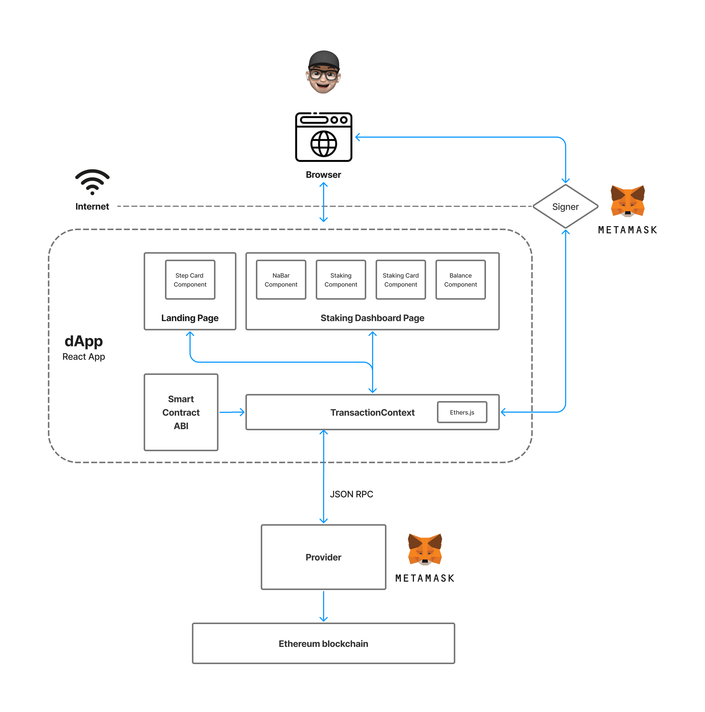

# CIBC Stars - DAPP Frontend

## Design Overview

## TransactionContext
Context provides a way to pass data through the component tree without having to pass props down manually at every level.
TransactionContext is used to send request to smart contract deployed on the ethereum blockchain.

`connectWallet() //connect to user's wallet`

`checkIfWalletIsConnected() //check if wallet is connect every time page rerendered`

`mintToken(userAddress) //deposit initial token to user's wallet`

`setUserIdentity(userName, address) //save user's name and address in DigitalIdentityContract`

`checkUserName(userAddress) //look up user's name by using address`

`stake(stakeeAddress) //stake tokens to stakee`
  